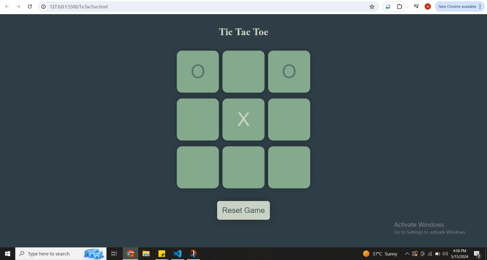

# Tic Tac Toe Game

This is a simple Tic Tac Toe game built using HTML, CSS, and JavaScript.

## Features

- Play against a friend 
- Simple and intuitive user interface
- Keeps track of game scores

## Usage

1. Clone or download the repository.
2. Open the `TicTacToe.html` file in your web browser.
3. Click on a grid cell to place your mark (X or O).
4. The game will automatically determine the winner or declare a draw. You have options to reset and restart the game.
